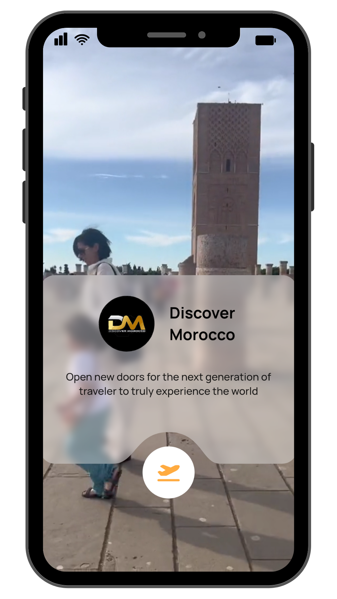
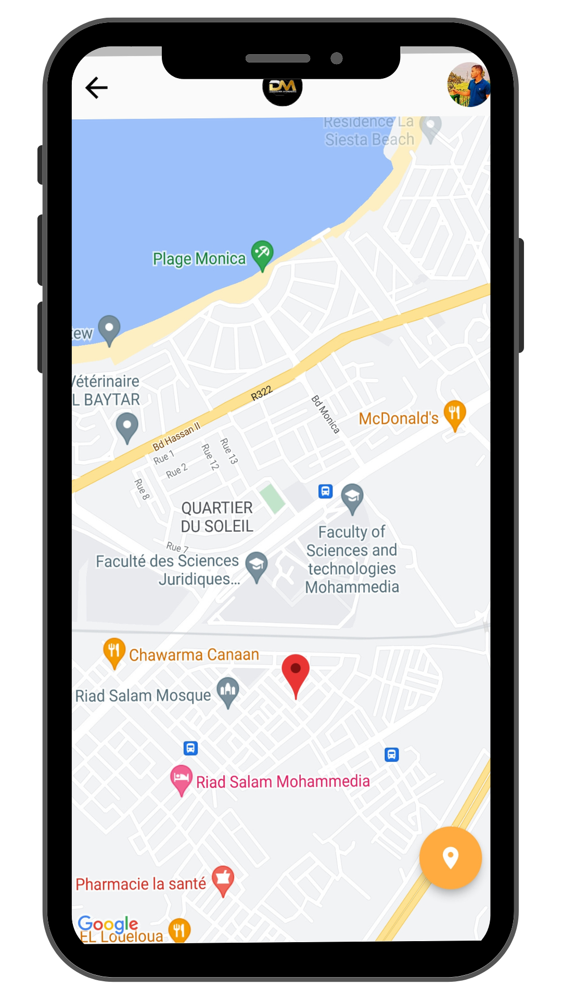
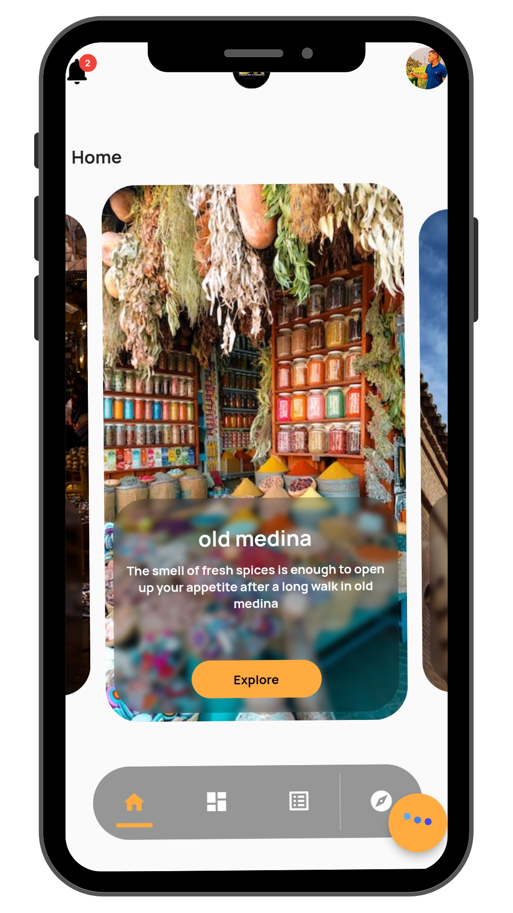
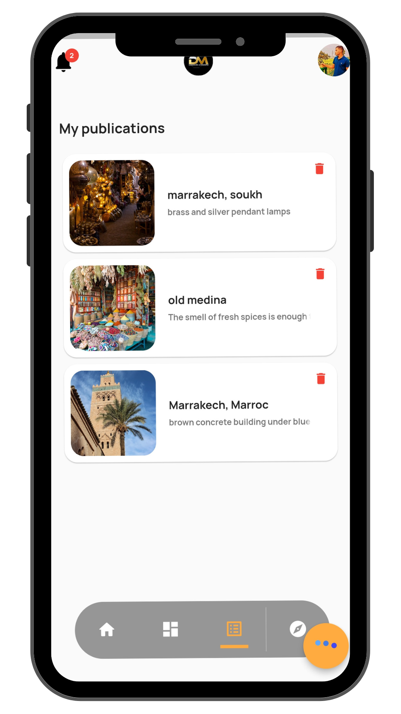
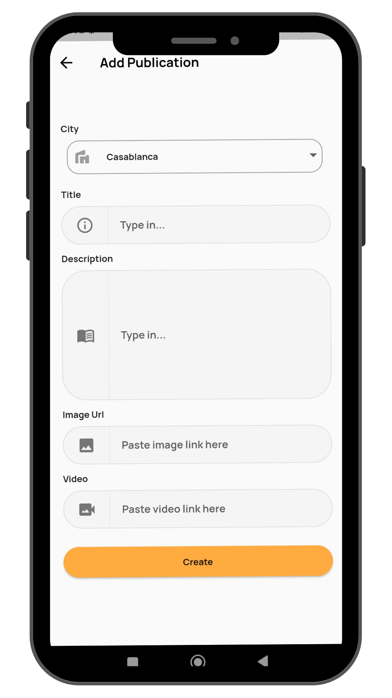
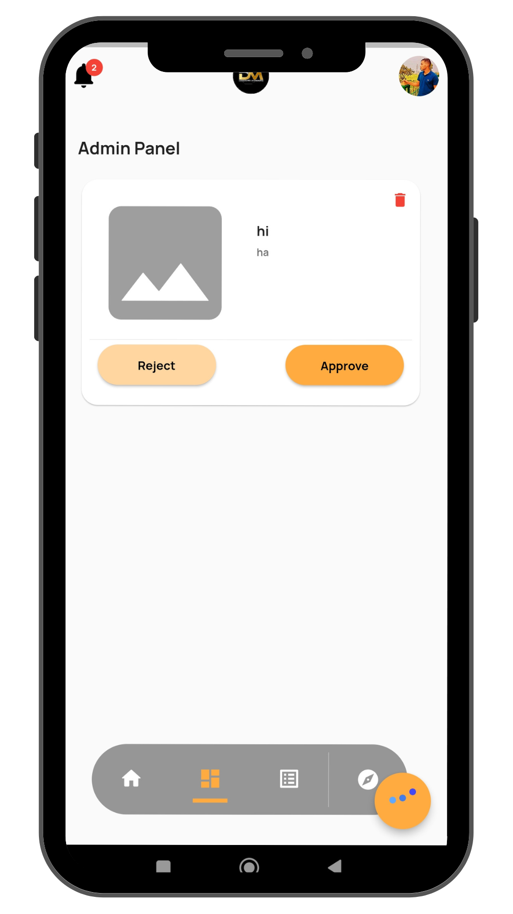
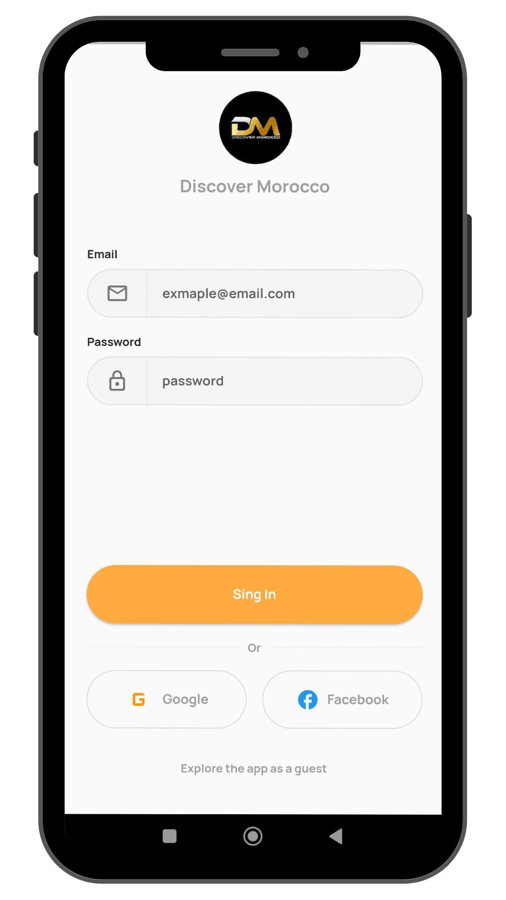
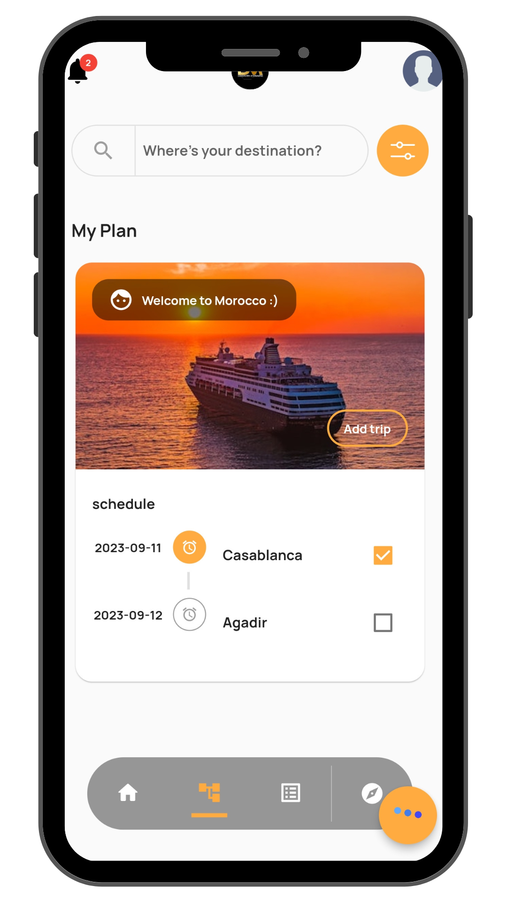
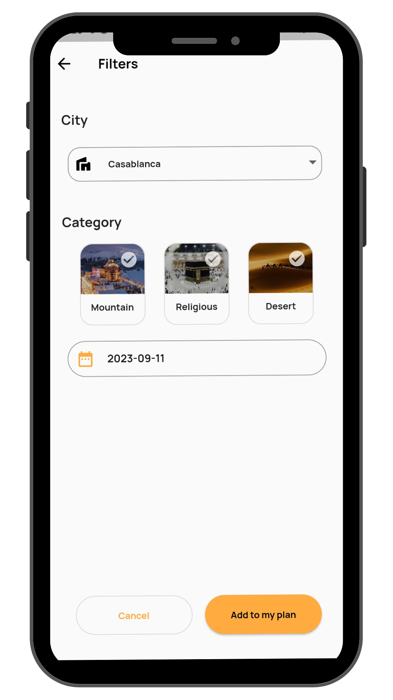

# discover_morocco

Available on Google Play Store: https://play.google.com/store/apps/details?id=com.tourism.discover_morocco&pli=1

## Description

Discover Morocco is an application that allows you to discover the most beautiful places in Morocco. It is a tourist guide that provides you with all the information you need to know about the monuments, the cities, the beaches, the mountains, the deserts, the museums, the hotels, the restaurants, the cafes, the shops, the festivals, the events, the activities, the sports, the culture, the history, the art, the artists, the craftsmen, the cuisine, the recipes, the music, the movies, the series, the celebrities, the personalities, the news, the weather, the climate...

## Screenshots
<table  
style="width:100%; border-spacing:0px; border-collapse:collapse; border-width:0px; border-style:none; border-color:#000; margin:0px; padding:0px; border:0px;">
>
<tr>
<td></td>
<td></td>
</tr>
<tr>
<td></td>
<td></td>
</tr>
<tr>
<td></td>
<td></td>
</tr>
<tr>
<td></td>
<td></td>
</tr>
<tr>
<td></td>
<td></td>
</tr>
</table>

## Author
Abderrahmane ET-TOUNANI

